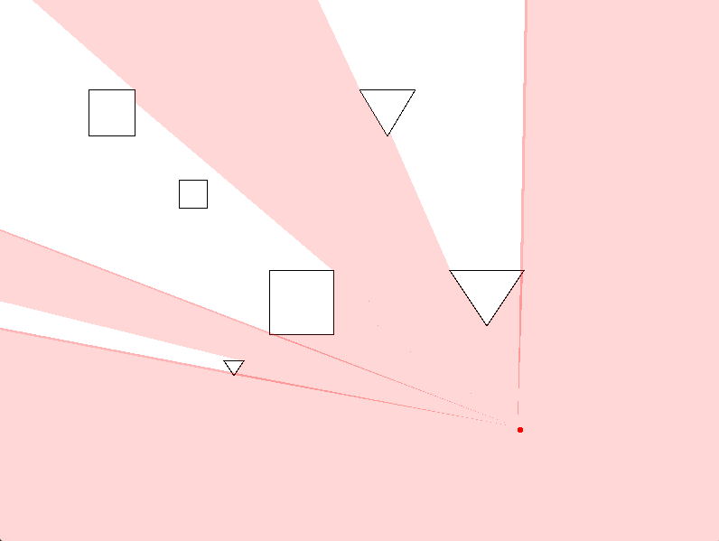
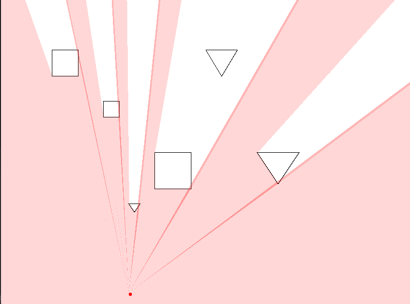
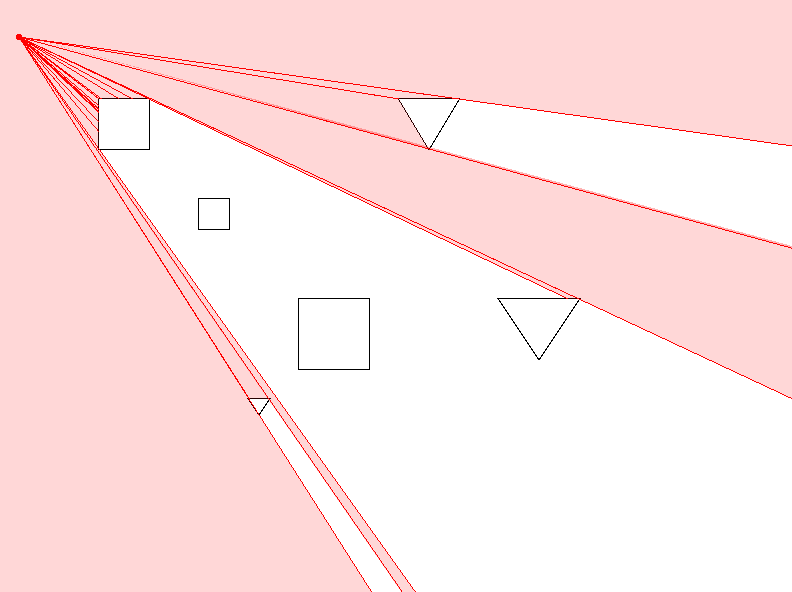
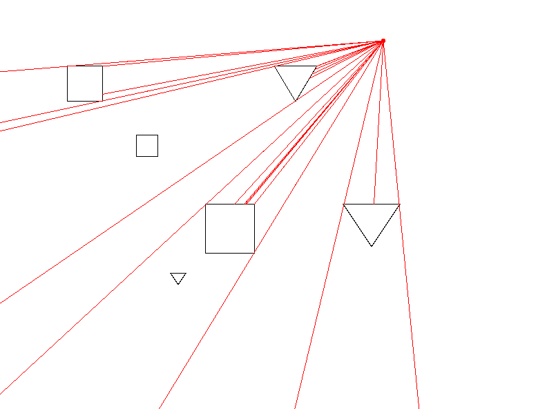

# Vision and Light Simulation

This project demonstrates a basic vision and light effect using SFML. A player, represented by a circle, can move around the window, with light rays cast towards the edges of shapes and the window, simulating the player's vision.

## Features

- **Shape Entities**: The project includes several convex shapes that act as obstacles for the light rays. 
- **Ray Casting**: Rays are cast from the player's position to the vertices of the shapes and the corners of the window. The intersection points of these rays with the shapes are calculated to determine the edges of the light effect.
- **Light Effect**: The player's "vision" is represented by a semi-transparent red light that adapts dynamically to the shape of the environment.
- **Toggle Display**: Use keyboard controls to toggle the drawing of polygons and lines.

## Controls

- **Move**: Move the player by moving the mouse.
- **Toggle Lines**: Press `R` to toggle drawing the lines representing rays.
- **Toggle Polygons**: Press `T` to toggle drawing the polygons representing the light effect.

## Mathematical Concepts

### Line Intersection

The `LineIntersect` function determines where a ray intersects with the edges of shapes:

This function uses vector math, specifically the cross product, to find if and where two line segments intersect. The formula calculates two parameters, t and u, which represent where the intersection occurs along each segment. If t and u are within [0, 1], the segments intersect.

### Ray Casting

The direction of each ray is calculated using basic vector subtraction. The intersection points are then used to draw the light effect.

### Angle Calculation

The function `angleBetween` calculates the angle between the player's position and each intersection point. This angle is crucial for sorting intersection points, ensuring the light polygons are drawn in the correct order to create a smooth light effect.

### Polygon Drawing
The light effect is created by drawing triangles between the player and intersection points. The vertices of each triangle are sorted based on the angle to ensure a continuous and accurate light effect.

## Screenshots

